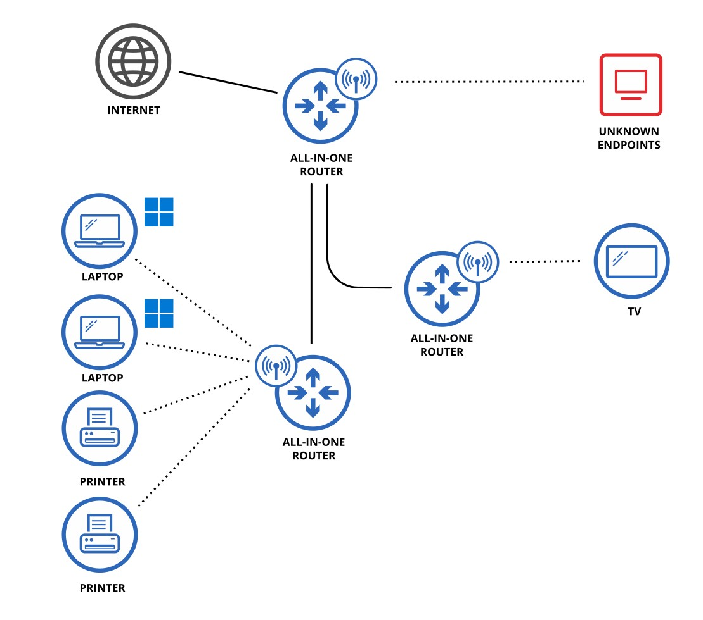
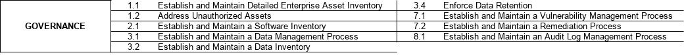
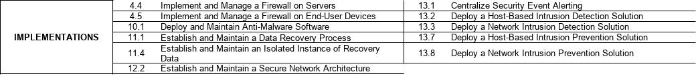
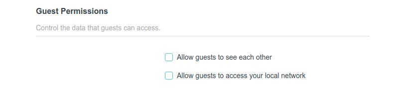
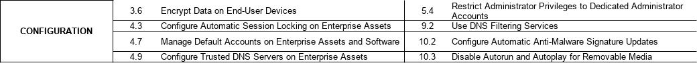
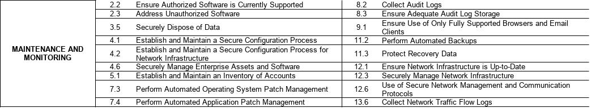
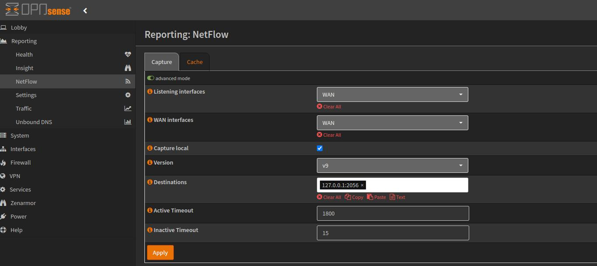
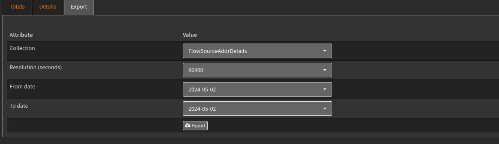
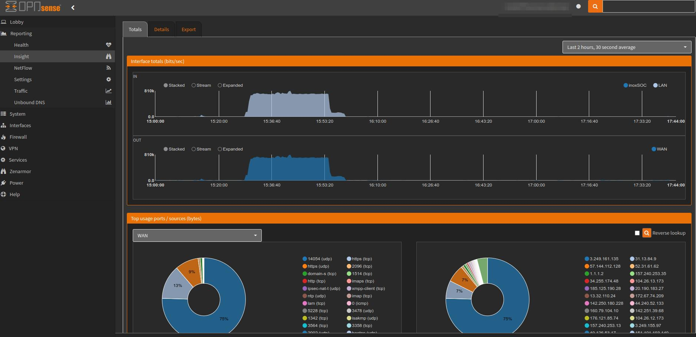
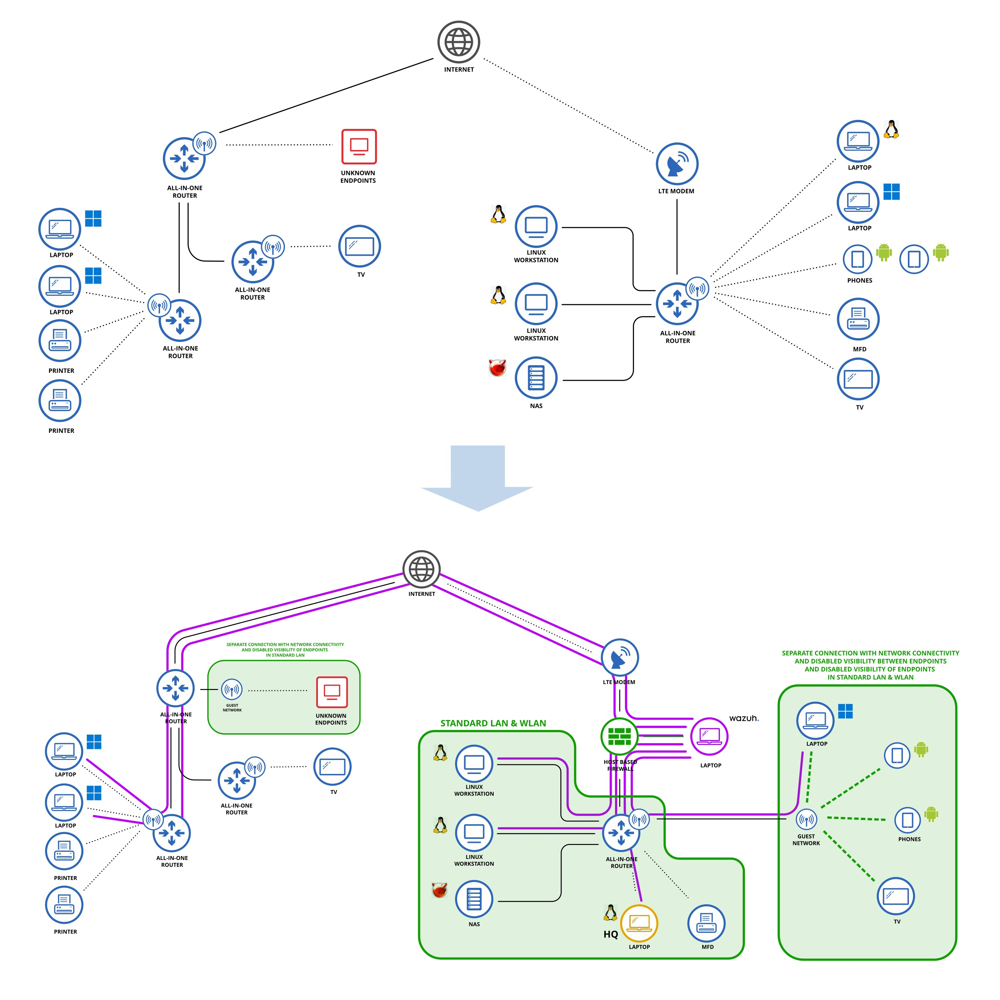

# About

This personal project is a continuation of education in the field of information security and a hands-on practical approach. Its aim is to assess current situation, improve security and increase awareness of individuals affected by this project.  
Activities described here were carried out in real systems (not in a lab environment) and with the consent (and cooperation) of the individuals to whom these systems belong.
By no means is this a how-to guide. All operations here were conducted by unexpirienced individual not employed in the information security.

# Index

- [Project Goals](#project-goals)
- [Project Requirements](#project-requirements)
- [TLDR](#tldr)
- [Client Profile](#client-profile)
- [Risk Assessment](#risk-assessment)
    - [1.  Assesment Scope](#1-assessment-scope)
    - [2.  Identifying Assets](#2-identifying-assets)
    	- [2.1 Location A](#21-location-a)
			- [2.1.1 Physical](#211-physical-assets)
			- [2.1.2 Information Technology](#212-it-assets)
			- [2.1.3 Data Flow](#213-data-flow)
			- [2.1.4 Vulnerability Scanning](#214-vulnerability-scanning)
    	- [2.2 Location B](#22-location-b)
			- [2.2.1 Physical](#221-physical-assets)
			- [2.2.2 Information Technology](#222-it-assets)
			- [2.2.3 Data Flow](#223-data-flow)
			- [2.2.4 Vulnerability Scanning](#224-vulnerability-scanning)
	- [3. CIS RAM Risk Analysis](#3-cis-ram-risk-analysis)
	- [4. Risk Treatment](#4-risk-treatment)
		-  [4.1 Governance](#41-governance)
		-  [4.2 Implementations](#42-implementations)
		-  [4.3 Configuration](#43-configuration)
		-  [4.4 Training and individial configurations](#44-training-and-individial-configurations)
		-  [4.5 Maintenance and Monitoring](#45-maintenance-and-monitoring)
- [What's been done](#whats-been-done)

# Project Goals

- conducting risk assessment;
- implementating solutions resulting from risk assessment analysis;
- correcting general security posture;
- increasing security awareness.

# Project Requirements

- matching solutions to potential threats resulting from threat analysis;
- keep cost as low as possible - use Open Source solutions if possible;
- using existing network assets if possible;
- keeping normal operations undisturbed while making changes during working hours; 
- avoiding becoming excessively paranoid.

# TLDR

This project grew in size. So if you're in a hurry and would rather like to take time reading new CVE descriptions than wasting time on each action taken here, I have prepared a [summary of what has been done](#whats-been-done)...

# Client Profile

This project targets systems in two separate locations. In each of these locations operates two businesses. 4 businesses in total.

- Location A runs an office that accepts clients for Business 1. Business 2 at location A occupies the same office but does not meet with it's clients.  
- Location B ic closed for any visitors. Both businesses operate in one office.

All businesses are low profile and operate in services industry. Income is moderate or low. Client aquisition is mostly done without marketing camapaigns. Business owners are related to each other.

For future reference:

- Location A
    - Business 1
    - Business 2
- Location B
    - Business 3
    - Business 4

All four businesses have marginal knowledge about information security.

# Risk Assessment

This Risk Assessment is not "Enterprise grade". It's shape is tailored to address very small businesses.

## 1. Assessment Scope

Until the beginning of this project all four businesses did not evaluate any risk analysis so the scope of this project is to assess general security posture. This assesment will take into consideration physical and IT components.  
This project does not cover mission, obligations and policies issues because they are usually the responsibility of management which, due to the scale of these businesses, is simply missing.

## 2. Identifying Assets

### 2.1 Location A

#### 2.1.1 Physical assets

||inventory  identifier|asset|
|-|-|-|
|1.|L1-P1|Premises gate with lock|
|2.|L1-P2|Lock on the office entry door|
|3.|L1-P3|Surveilance camera targeting front gate|
|4.|L1-P4|Big loud dog|

#### 2.1.2 IT assets

Even though risk analysis takes place later in the project, CIS RAM which will be used for this task mentions identifying IT assets with:
- network address (if static);
- hardware address;
- machine name;
- enterprise asset owner;
- department for each asset;
- whether the asset has been approved to connect to the network.

Lists of assets presented below are simplified. Although the detailed lists has been created internally but they wan't be published in this project. 

||inventory   identifier|type|model / system|
|-|-|-|-|
|1.|L1-IT1|All-In-One Router|TP-Link AX-1500|
|2.|L1-IT2|All-In-One Router|TO-TO Link|
|3.|L1-IT3|All-In-One Router|TO-TO Link|
|4.|L1-IT4|Laptop|Windows Pro|
|5.|L1-IT5|Laptop|Windows Home|
|6.|L1-IT6|Printer|Brother|
|7.|L1-IT7|Printer|Epson|
|8.|L1-IT8|Smart TV| Samsung|
|9.|L1-IT9|Smartphone|Samsung|
|10.|L1-IT10|Smartphone|IPhone|

#### 2.1.3 Data Flow

#### 2.1.4 Vulnerability Scanning 

[Link to full report](/imgs/nessus_scanning/Location%20A-them1i.pdf)

### 2.2 Location B

#### 2.2.1 Physical assets

||inventory  identifier|asset|
|-|-|-|
|1.|L2-P1|Premises gate with lock|
|2.|L2-P2|Lock on the office entry door|
|3.|L2-P3|Small medium loud dog|

#### 2.2.2 IT assets

||inventory   identifier|type|model / system|
|-|-|-|-|
|1.|L2-IT1|Modem LTE|Huawei B525s-23a|
|2.|L2-IT2|All-In-One Router|TP-Link Archer C80|
|3.|L2-IT3|Linux Workstation|Arch Linux|
|4.|L2-IT4|Linux Workstation|Arch Linux|
|5.|L2-IT5|Laptop|Arch Linux|
|6.|L2-IT6|Laptop|Windows 11|
|7.|L2-IT7|Multifunction Device|Brother MFC J5910DW|
|8.|L2-IT8|Smart TV| Samsung|
|9.|L2-IT9|Smartphone|Blackview BV9900 Pro|
|10.|L2-IT10|Smartphone|Samsung|
|11.|L2-IT11|NAS|TrueNas|

#### 2.2.3 Data Flow

#### 2.2.4 Vulnerability Scanning

**Nessus - Basic Network Scan**

**Nessus - Basic Network Scan with credentials provided**

**Nessus - Basic Network Scan with credentials report**

[Link to REPORT](/imgs/nessus_scanning/Location%20B%20-%20credentials_rmnxdq.pdf)

[Back to index](#index)

## 3. CIS RAM Risk Analysis 

Due to limited cybersecurity expertise and to have a well defined starting point I've decided to use CIS Risk Assessment Method. It's a structured approach to conducting cybersecurity risk assessments. It provides a framework to identify, analyze, and prioritize cybersecurity risks based on industry-recognized standards. CIS RAM aims to help organizations improve their cybersecurity posture by providing guidance on risk management, controls, and mitigation strategies. 

For this project I've used IG1 set of safeguards as a basis and some IG2 and IG3 safeguards where it was relevant. I also removed some IG1 safeguards which did not relate to projects conditions and targeted businesses.

It is worth emphasizing that although we are dealing with 4 different businesses, for the purposes of this project we treat them as one organization. It's best for making the whole process simpler. 

[Back to index](#index)

## 4. Risk Treatment 

Risk treatment in this project will mainly rely on implementing CIS RAM safeguards. I will also address some vulnerabilities discovered in vulnerability scanning. These treatments are mainly IT and staff training related. After analysis of physical safeguards we agreed that they are appropriate and they correspond to the scale of the businesses.

All actions needed to be performed in the scope of Risk Treatment has been divided into 5 groups:
- [4.1 Governance](#41-governance)
- [4.2 Implementations](#42-implementations)
- [4.3 Configuration](#43-configuration)
- [4.4 Training and individial configurations](#44-training-and-individial-configurations)
- [4.5 Maintenance and Monitoring](#45-maintenance-and-monitoring)

## 4.1 Governance

This part has been partly covered already in [asset identification part](#2-identifying-assets).

The project concerns small one-person businesses, so we did not apply excessive formalities. Through meetings and prepared short documents, we established rules and procedures, as well as the course of action in various situations. We addressed all points from the above list. These documents and agreements created are not to be attached here.

## 4.2 Implementations

### Rebuilding Network Architecture to address security issues

In ideal scenario network should be rebuilt with:
- separate APs for work environment, private use and separate untrusted devices (TVs,phones etc.);
- managed 3Layer switches with VLANs enabled;
- host-based firewalls.

But this would be an expensive and probably exaggerated solution compared to potential risks.

Thankfully all routers used in both locations has implemented "Guest Network" function with option for disabling visibility of hosts inside this network.

### Deploying host-based firewall with intrusion detection and prevention solutions

I decided to install in Location B an endpoint which would gather data from outside local network. Those data will be collected from hosts in Location A and hosts from Location B which work remotely. This means opening ports outside of local network. And this is a reason why more advanced firewall than the one found in All-In-Router would be needed. Also it's a good ocasion to practice network appliance implementation and configuration.

For this project I decided to go with OPNsense. An open source, statefull firewall and routing platform with Intrusion Detection and Prevention solutions and many other features.

I built it from some spare parts I had already (frame, PSU, motherboard, SSD) and purchased Intel NIC, AMD Athlon processor and fresh RAM. 
Instalation and initial setup took no time. 

I aslo installed Zenarmor for NGFW functionalities.

OPNsense configurations will be covered in appropriate chapters.

### Implementing SIEM solution with XDR capabilities

For security event alerting and host-based IDS / IPS I decided to go with Wazuh. 
It's an Open Source solution which features:
- Malware Detection
- Configuration Assessment
- File Integrity Monitoring
- Threat Hunting
- Log Data Analysis
- Vulnerability Detection
- Incident Response
- Regulatory Compliance
...and more.

Wazuh is a server - client type solution with "agents" collecting data from endpoints and a central component (which can be split into separate components) for processing, analysing and displaying information to the user.

I decided to set up a server unit on an unused Dell laptop. 
Installed plain Debian and complete server-side suite (wazuh-server, wazuh-indexer and wazuh-dashboard) with a "wash-and-go" script available in Wazuh documentation.
As far as Dell laptop stays in remote location and is managed remotelly I had to kill screen with command: 

`vbetool dpms off` 

For remote system management I've prepared ssh keypairs using `ssh-keygen`.
Nothing fancy. Just for the record.

For remote agents communication with server, changing LTE modem was necessary (due to lack of configuration options). New modem has been set in IP-passthrough for easier NAT configuration. 
In OPNsense simple NAT port forwarding for 1514 - agent communication and 1515 - agent enrollment:

For local agents communicationg with server remotelly via public IP (laptop working in office and out of office) "Nat Reflection" option has to be enabled.

Wazuh. configurations will be covered in appropriate chapters.

### Final network topology after changes

**Location A**

**Location B**

**Wazuh agents communication**

### Establishing backup solutions

**Location A** specifics:

- there are no internet services available externally;
- business operations are not carried with critical deadlines;
- size of data to be backed up is moderate or low.

**Our process:**

- Encrypted backups of working files, archived data and e-mails to  storage share via Webdav using  every 1 hour.
- Same set of backups with Duplicati to constantly connected external HDDs.
- Backup of archived data as encrypted 7zip files to different external HDDs and to internet storage every week on friday.

***

**Location B** specifics:

- large amounts of files may be created or modified every day;
- there are no internet services available externally;
- business operations are not carried with critical deadlines;
- loosing large amount of data may slow down operations significantly;
- size of data to be backed up is low to moderate/high depending on workload.

**Our process:**

- Backups of working files and e-mails on local drive and NAS simultaneously using [script in Python I once created](https://github.com/inox-vision/PythonProjects/tree/master/02%20Mirror_Synchroniser) (script compares origin and destination and decides if a newer version of a file should be stored. It also creates history of modified and deleted files in .history folder and stores them for given amount of time). Backup process is initiaded with systemd timer.
- Backup of archived data (kept on NAS) in web storage and on external drives (encrypted with dm-crypt) once a week.

***

### Deploying Anti-Malware software

**Windows**  
For Windows machines using 'Windows Security' tool for real-time protection should be completelly fine. Implementing any 'higher' version of Microsoft AV solution while having SIEM with XDR, IPS and IDS enabled already would be doubling the same functionalities.

**Linux**  
On Linux machines I used Clamav,considered as one of the best open source Linux antivirus scanners available.

Because it's an on-demand scanner I had two choices to gain real-time or near-real-time protection. 

For ***near-real-time*** protection I created a short command which finds modified/changed/accessed files in locations specified in a file and scans it. Automating it with systemd **timer** unit for scanning every 15mins would do the trick.

`tr '\n' '\0' < files_to_scan | find -files0-from - -cmin -15 -type f -print0 | xargs -0 clamdscan --fdpass --move=/home/adrian/clamscan_quarantine --log=/home/adrian/.clamscan_log` 

However I finally went with ***real-time*** protection enabling ***On Access Scanning*** described in [official documentation](https://docs.clamav.net/manual/OnAccess.html) and in [Arch Wiki](https://wiki.archlinux.org/title/ClamAV) . 

***
### Deploying Firewall on end user machines

On Linux I've installed package and enabled service for [firewalld](https://wiki.archlinux.org/title/firewalld).

On Windows machines firewall is built into Windows Defender.

***
### 4.3 Configuration

### Encrypting data on end user devices

I decided to do Full Disk Encryption on portable devices that leave workspaces.

**Linux**

For Linux I used dm-crypt solution, which is built into Linux Kernel. 

[DM-Crypt on Arch Wiki](https://wiki.archlinux.org/title/dm-crypt)

I've set up a new system with LUKS encryption and BTRFS filesystem. 

**Windows**

Although Windows Home has implemented lighter version of BitLocker and Windows Pro has BitLocker built in, I decided to go with Open Source solution. For this purpose I used VeraCrypt, a successor of TrueCrypt project. All remotelly used laptops has been encrypted.

***

### Configuring secure connection for remote management

For secure connection with my internal network, to manage endpoints and have remote access to Wazuh Dashboard I decided to implement VPN connection. I chose Wireguard VPN.

**Configuration on OPNsense:**

**Configuration on Arch Linux laptop (HQ)**

**NAT configuration**

At this moment I only need to have an overview on Wazuh manager (dashboard runs on port 443) and I want to periodically SSH to this machine.

Due to split tunnel configuration I was able to connect my VPN only for local network management. The rest of my normal traffic is carried outside of VPN.

***

### DNS configuration

***

### Coniguring IDS/IPS in OPNsense firewall

OPNsense has built in [Suricata](https://suricata.io/) engine based IDS/IPS system. I enabled this service and for learning and testing purposes I downloaded and enabled all rulesets available. Periodic log analysis and catching false positives will be interesting lesson on what might be really needed in my situation.

I also registered for [ET PRO Telemetry](https://docs.opnsense.org/manual/etpro_telemetry.html) to test the solution and observe alerts or droped packets if they show up.

***

### Wazuh setup

#### Agents upgrading

Wazuh let's user upgrade agents remotely.  
To list agents and versions are they on:

`/var/ossec/bin/agent_upgrade -l`

For agent upgrade:

`/var/ossec/bin/agent_upgrade -a <agent id>`

#### Vulnerability scanning

Vulnerability scanning is not enabled by default. It has to be enabled in `agent.conf`.

After restarting manager, vulnerability scans are visible in dashboard.

### Other completed tasks

- Looked for default accounts on network devices and installed software to disable them or change default credentials. Found none;
- Configured automatic malware signatures updates (Windows Defender default updates), started and enabled `clamav-freshclam.service` for ClamAV;
- Configured automatic screen lockout on short periods in both locations on every machine.
- Autorun and autoplay on removable media on all machines has been disabled;
- Administrator priviliges has been reviewed and restricted where possible. On OPNsense and TrueNAS user accounts has been created for not managerial operations. On Windows machines users requested to keep administrator accounts for easier management.

***

### 4.4 Training and individial configurations

IT assets used by individuals are not only used for work purposes but also for personal activity. This is why it's important to address both work and personal activities to limit risk of unwanted actions leading to exposing vulnerabilities. Training on social engineering methods, guidance (or help) with safe software instalation and management and general IT hygiene to preserve privacy were important topics for this part of the project.

***

### Creating dedicated contact for security incidents and alerts

For alerting incidents or any suspicious acitivity `security@******.com` e-mail has been created.

***

### Training on social engineering attacks, security awareness and use of insecure networks

Training on recognizing social engineering attacks is an important part of this project. 

According to one of many reports:
- [Verizon DBIR Report](https://www.verizon.com/business/en-gb/resources/2022-data-breach-investigations-report-dbir.pdf) - 82% of breaches involved the human element
- [IBM X-Force Threat Inteligence Index](https://www.ibm.com/reports/threat-intelligence) - in 2023 41% of initial attack vector was phishing.

Due to low profile of businesses covered by this project, risk of targeted attack is significantly lower than oportunistic social engineering attack. Taking into account that work assets are used for social media and other personal activities, it's important to bring caution to every suspicious behaviour or indicators.

During training we covered:
- methods for discovering true sender of an e-mail;
- recognizing social engineeering methods used in voice/mail/message;
- raising awereness of deepfakes and their potential in social engineering attacks;
- recognizing untrusted requests for sensitive data;
- verifying trustworthy websites;
- importance of data handling;
- importance of PII handling (GDPR);
- raising awareness of clients with potentially mailicious intensions;
- in case of any doubt send notification via security alerting e-mail.

&nbsp;

We also discussed about human cognition functions that are commonly exploited:

- **Authority** - the instinct to respond to authority;
- **Trust** - the tendency to trust;
- **Responsiveness** - the desire to be responsive;
- **Fear** - the fear of doing the wrong thing;
- **Urgence** - the need to act quickly;
- **Threat** - the threat of harm to others or oneself;
- **Reward** - the promise of a reward;
- **Curiosity** - the desire to be in the know.

&nbsp;

#### Insecure Networks

Although nowadays:
- way over 90% of web traffic is encrypted; 
- web browsers indicate that site you browse is not secure;
- mail services use encrypted protocols,

there is still some chance of connecting to public insecure network, using unencrypted protocol and revealing some unencrypted data. Especially when [Evil Twin router](https://en.wikipedia.org/wiki/Evil_twin_(wireless_networks)) is quite easy to deploy.

This is why when remotely connecting to internet I adviced using 'Hot-Spot' function on a smartphone with at least WPA-2 protection and strong password.  

***

### Managing passwords and authentication practices

For password management I've chosen  . 

I've helped users to install main application and browser extensions on desktops and mobile devices. After that we went through the process of changing existing passwords to new strong passwords generated by the app.

Despite my best intensions users did not accept the idea of implementing 2FA keys, due to cost of this implementation. So I instructed them on using Bitwarden carefully, only when it indicates that a domain curently open is recognised by extension, what is show by number beside icon  . If opened website is not recognised  , extension does not provide easy way for filling loging form. If domain is not recognised when it should be (in users opinion), user should send notification via security alerting e-mail.

***

### Training on data handling and data exposure

For individuals working in Location A it was important to realize that clients visiting the office can have malicious intentions. Even the old, well known ones can be potentially harmfull if they get into possession of unathorized data.

This is why we discussed importance of 'clean desk rule' and installing lockers on desk drawers so each time when a client is left in the office alone or if he sits at the desk, the risk of stealing sensitive information is lowered to minimum. This is also valid for cork boards on which pinned content should be managed carefully.

### 4.5 Maintenance and Monitoring

### Audit logs

Wazuh collects various types of logs, including Audit Logs. These logs are stored for very long period because 120GB disk is more than enough for just 7 agents.

### Collecting NetFlow logs

OPNsense has built in NetFlow logs collection. And it's easy to setup. It also has logs export to .csv functionality.
Logs will be periodically exported and stored on NAS for future investigations.

[Back to index](#index)

***
# What's been done

- client analysis;
- physical and IT assets inventory;
- IT assets topology;
- vulnerability scanning with Nessus Essentials;
- data flow analysis;
- risk assessment based on CIS RAM framework;
- network architecture has been rebuilt to address segmentation and isolate important assets
- deployment and configuration of host-based firewall (OPNsense) on self built PC;
- deployment and configuration of Debian based system with Wazuh SIEM software;
- analysis and configuration of backup solutions within local and remote infrastructure;
- deployment of real-time anti-malware solution on Linux machines;
- deployment of firewall solution on Linux machines;
- Full Disk Encryption on mobile working devices using VeraCrypt (for Windows) and Crypt-dm (for Linux);
- configuration of Wireguard VPN for remote communication and management;
- configuration of IDS/IPS on host-based firewall including ET PRO Telemetry;
- smaller configuration tasks to address risk assessment results;
- set up SSH keys for secure management;
- creating dedicated contact form for security incidents and alerting;
- training on social engineering attacks, data handling and security awareness;
- configuring and training on safe methods for password creation and storage;

